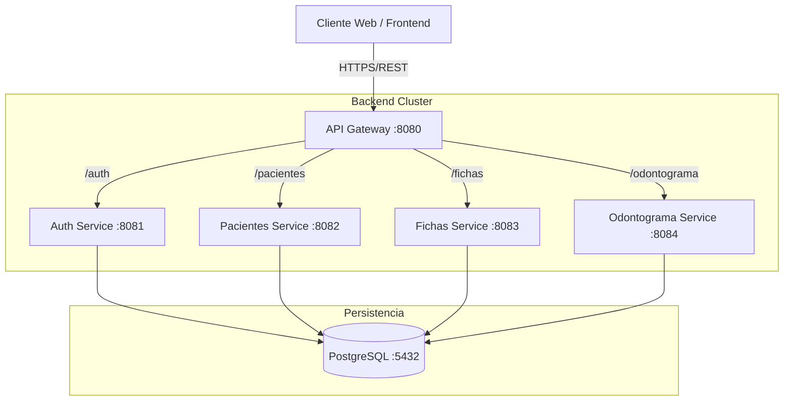

# Sistema de Gestión Odontológica - Arquitectura de Microservicios

## 📄 Descripción del Proyecto

El presente proyecto consiste en el desarrollo e implementación de una plataforma web distribuida, diseñada para la gestión integral de clínicas odontológicas. La solución se centra en la digitalización de la **Ficha de Diagnóstico y Tratamiento Endodóntico** (basada en el estándar Endonova), permitiendo un control detallado de la historia clínica, gestión de pacientes, presupuestos y evolución de tratamientos.

---

## 📂 Entregables y Recursos del Proyecto

A continuación se detalla la ubicación de los recursos solicitados para la evaluación:

### 1. Código Fuente
* **Repositorio:** La estructura de carpetas contiene el código fuente segregado por microservicios (`/backend`) y la aplicación cliente (`/frontend`).
* **Scripts de Despliegue:** * `docker-compose.yml`: Orquestación de contenedores y base de datos.
    * `Dockerfile`: Configuración de imagen individual en cada directorio de servicio.

### 2. Documentación Técnica

#### Diagrama de Arquitectura del Sistema
El sistema sigue un patrón de API Gateway para centralizar las peticiones:



#### Documentación de API (Swagger)

Una vez desplegado el sistema, la documentación interactiva de los endpoints está disponible en:

* **Pacientes:** `http://localhost:8082/swagger-ui.html`
* **Fichas:** `http://localhost:8083/swagger-ui.html`
* **Odontograma:** `http://localhost:8084/swagger-ui.html`

### 3. Manual de Usuario

La guía detallada para el uso de la aplicación por parte de doctores y administradores se encuentra disponible en formato PDF en el directorio de documentación:

> 📘 **[Descargar Manual de Usuario](./Docs/ManualUsuario.txt)**


---

## 👥 Equipo de Desarrollo

* **Bravo Leandro** - Odontograma Interactivo
* **Enriquez Michael** -  Integración Frontend & UI/UX
* **Jimenez Yasid** -  Arquitectura & Seguridad
* **Romero Erick** -  Gestión de Pacientes
* **Ochoa Aubertin** -  Fichas Técnicas & Endodoncia

---

## ⚙️ Instrucciones de Instalación y Ejecución

Para ejecutar el entorno de desarrollo, siga los siguientes pasos estrictamente en el orden descrito.

### Prerrequisitos

* Java JDK 17+
* Node.js & npm
* Docker & Docker Desktop

### Paso 1: Clonar e Infraestructura

```bash
git clone <URL_DEL_REPOSITORIO>
cd proyecto-odontologia
docker-compose up -d

```

> **Nota:** Esto levantará la base de datos PostgreSQL necesaria.

### Paso 2: Ejecución de Microservicios (Backend)

Se recomienda levantar los servicios en el siguiente orden para evitar fallos de dependencia:

1. **API Gateway** (Puerto 8080)
2. **Auth Service** (Puerto 8081)
3. **Resto de Servicios** (8082, 8083, 8084)

### Paso 3: Ejecución del Cliente Web (Frontend)

```bash
cd frontend
cd cliente-odontologia
npm install
npm start

```

La aplicación estará disponible en `http://localhost:3000`.
